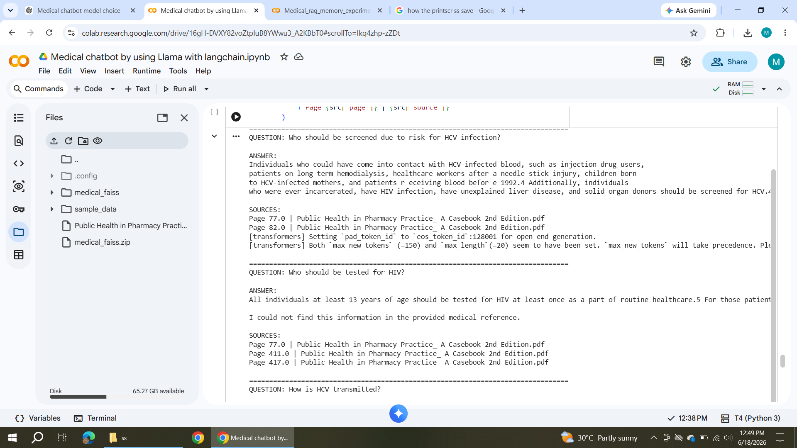
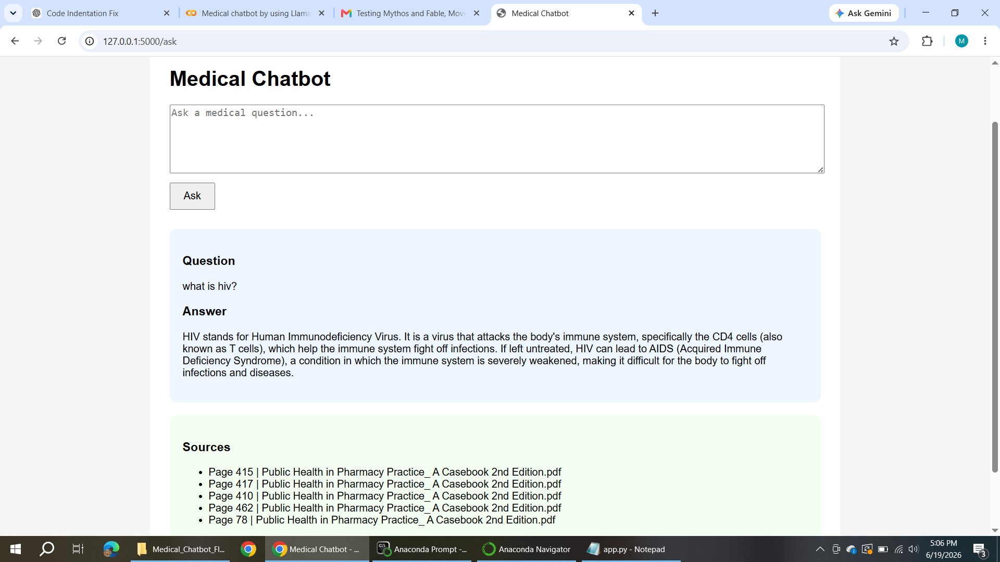
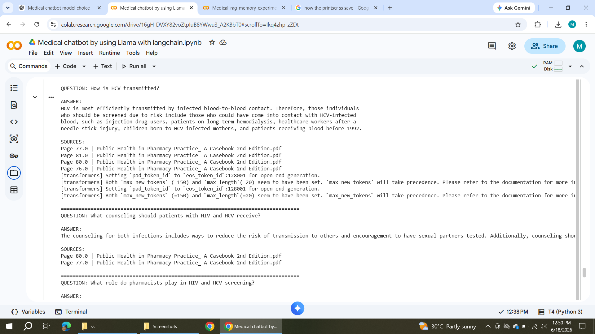
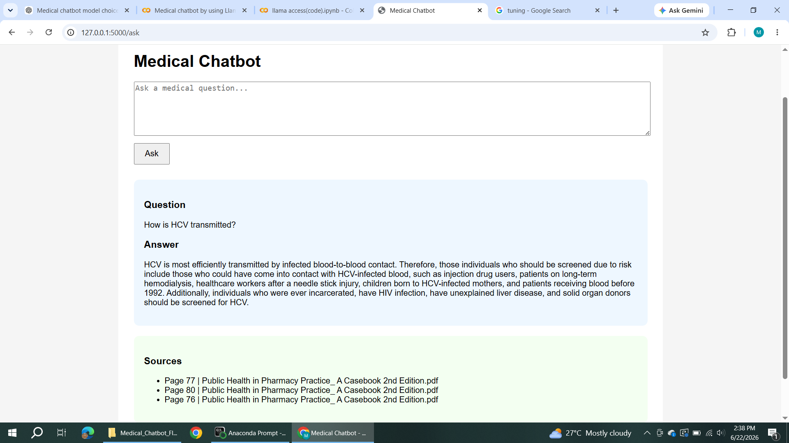

# Medical RAG Chatbot using Llama 3.2

## Overview

A Retrieval-Augmented Generation (RAG) Medical Chatbot built using Llama 3.2, LangChain, FAISS, Hugging Face Embeddings, and Flask.

The chatbot answers medical and pharmacy-related questions from a medical textbook PDF and provides source citations with page references.

---

## Features

* Medical Question Answering
* Retrieval-Augmented Generation (RAG)
* Source Citation with Page Numbers
* PDF Knowledge Base Search
* Llama 3.2 Powered Responses
* Flask Web Interface
* FAISS Vector Database
* LangChain Retrieval Pipeline

---

## Tech Stack

* Python
* Flask
* LangChain
* FAISS
* Hugging Face Transformers
* Sentence Transformers
* Llama 3.2 3B Instruct
* Retrieval-Augmented Generation (RAG)

---

## System Architecture

User Question

↓

FAISS Similarity Search

↓

Relevant Medical Context

↓

Llama 3.2

↓

Answer + Source Citations

---

## Screenshots

### Development in Colab

### Flask Medical Chatbot Interface

### Medical Answer with Source Citations

### Additional Interface Example

---

## Example Question

Question:

How is HCV transmitted?

Answer:

HCV is most efficiently transmitted by infected blood-to-blood contact. Therefore, those individuals who should be screened due to risk include those who could have come into contact with HCV-infected blood, such as injection drug users, patients on long-term hemodialysis, healthcare workers after a needle stick injury, children born to HCV-infected mothers, and patients receiving blood before 1992.

Sources:

* Page 77
* Page 80
* Page 76

---

## Future Improvements

* Conversational Memory
* Streamlit Deployment
* Hybrid Search
* Multi-PDF Support
* Medical Citation Ranking
* Docker Deployment

---

## Author

Madiha

Machine Learning & AI Engineer

Focused on Computer Vision, Medical AI, Segmentation Models, and LLM Applications.
